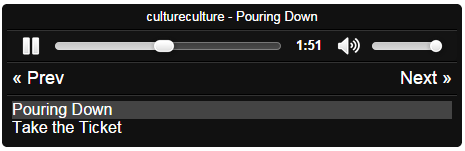

#Audio Player
##What?
A simple HTML5 audio player plugin for jQuery, supporting a playlist.

##Why?
Helping my brother create a music blog, I was struck by the lack of decent,
simple audio players that supported a playlist. After a cursory internet search,
I decided it'd probably be more fun (for me, not my brother) to code my own.

##How?
Like this!

    <html>
    <head>
        <!-- First the CSS -->
        <link rel="stylesheet" href="css/player.css">

        <!-- jQuery here! -->

        <!-- And now the magic sauce! -->
        
        
      </head>
      <body>
        

        

      </body>
    </html>

##What then?
You'll get something that looks a bit like this!

##Does it work?
Of course! Well, mostly. There are probably a few bugs - feel free to report them or squish them.

##Can I customise this monstrosity?
You can (just modify the CSS), but for now you can't do much about the HTML5 audio element's appearance using this plugin.

What you can do, is specify the location of your own next / previous buttons, and the location of the playlist container.
To do this, you simply pass those elements into the initial function call, like so:

    $("#my-player").audioPlayer({
      nextButton: $(".my-next-button"),
      prevButton: $(".my-prev-button"),
      listContainer: $(".my-list-container"),
      tracks: [
        {
          name: "Track One",
          artist: "Professor Famous",
          src: "mp3/professor_famous-track_one.mp3"
        },
        {
          name: "Track Two",
          artist: "Professor Famous",
          src: "mp3/professor_famous-track_two.mp3"
        }
      ]
    });

You can then style those elements however you like.

##What's next?
Things I'd like to add (in no particular order):

1. Ability to add / remove / swap tracks on the fly.
2. Ability to specify artwork for tracks (although simplicity is preferable to feature overload)
3. Support for custom player controls (play / pause / scrubber / timer etc)

##Anything else?
You can pass the following options into the plugin (defaults shown):

    $("#my-player").audioPlayer({
      autoPlay: false, //Whether to start playing immediately

      tracks: [], //An array of tracks of the form { name: "", artist: "", src: ""}

      controls: true, //Whether to display the HTML Audio element controls

      listContainer: null, //The jQuery wrapped element in which to display the playlist

      nextButton: null, //The jQuery wrapped element to use as the Next button

      prevButton: null //The jQuery wrapped element to use as the Play button
    });

##Attributions
Icons: [Font Awesome by Dave Gandy](http://fontawesome.io).
